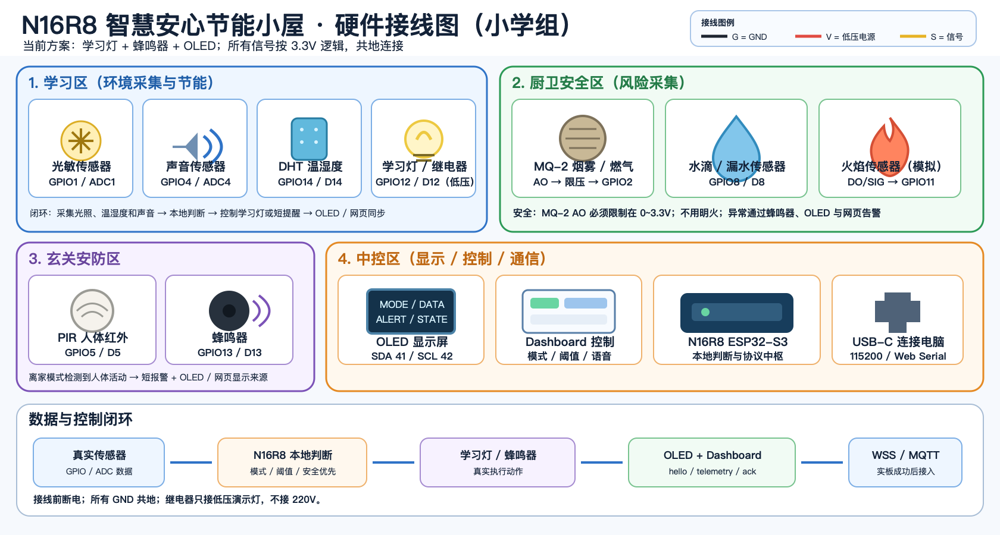

# N16R8 智慧安心节能小屋开发文档

更新日期：2026-07-12
项目目录：`/Users/yukii/Desktop/智慧生活/香港小学作品2`  
项目标识：`smartlife-primary-hk2`  
项目画像：`smartlife-primary-safe-energy-home-v1`  
GitHub 仓库：`https://github.com/lostmyukii/zhihuishenghuoxiao2.git`

实板存储合同：`16MB Quad Flash + 8MB OPI PSRAM`，PlatformIO 使用 `default_16MB.csv`，不得退回 8MB 无 PSRAM 配置。

实板 USB 串口为 CH340（VID:PID `1A86:7523`），固件使用 UART0 输出 `115200` JSON，PlatformIO 必须保持 `ARDUINO_USB_CDC_ON_BOOT=0`。

Dashboard 打开 Web Serial 后会自动释放 DTR，并用 RTS 进行约 `120ms` 硬复位，再等待约 `450ms` 接收 `hello/telemetry`。若页面显示“USB 已连接”但帧数仍为 0，应先点击“断开当前连接”，刷新页面后重新选择串口，不要同时打开 PlatformIO Monitor 或其他串口工具。

## 1. 项目目标

本项目面向小学组智慧生活赛项，核心作品为 **N16R8 智慧安心节能小屋**。作品用 N16R8 ESP32-S3 采集家庭小屋中的光照、温湿度、声音、人体与安全状态，自动控制低压学习灯和蜂鸣器，并通过 OLED、MQTT 与网页看板可视化展示真实状态。

小学组任务映射：

| 小学组任务 | 实现方式 | 现场可见结果 |
| --- | --- | --- |
| 数据采集 | 光敏、DHT、声音、PIR、MQ-2、水滴、火焰模拟 | OLED 与网页数值同步变化 |
| 智能控制 | 光照/温度/声音/安全阈值触发学习灯和蜂鸣器 | 遮光开灯，温度或声音超阈值提醒，异常报警 |
| 语音交互 | 网页语音或小智语音转安全白名单命令 | “开始学习”“我要出门”“家里安全吗”触发真实状态 |
| 节能响应 | 只有“有人且光线暗”才允许开灯，否则关闭学习灯 | 节能分上升，网页显示节能原因 |

## 2. 资料与文件

当前已存在：

| 文件 | 用途 |
| --- | --- |
| `设计方案.md` | 作品定位、任务映射、协议和路线总方案 |
| `AGENTS.md` | 后续代理/开发者必须遵守的工程约束 |
| `assets/n16r8-hk2-wiring-diagram.png` | 与硬件合同同步的硬件接线示意图 |
| `assets/n16r8-hk2-wiring-diagram.svg` | 接线图的可编辑矢量源文件 |
| `三个规则视频表述分析报告_副本3.md` | 智慧生活规则表达依据 |
| `三个视频任务要素重点注意详析_副本3.md` | 小学组四项任务依据 |

建议后续实现目录：

```text
香港小学作品2/
├── AGENTS.md
├── 开发文档.md
├── 设计方案.md
├── assets/
│   └── n16r8-hk2-wiring-diagram.png
├── firmware/
│   ├── platformio.ini
│   └── src/main.cpp
├── dashboard/
│   ├── index.html
│   ├── app.js
│   ├── style.css
│   └── sw.js
└── tools/
    ├── n16r8_gateway.py
    └── n16r8_cloud_relay.py
```

## 3. 硬件连接

接线示意图：



图是与本节 GPIO 合同同步维护的施工辅助图，精确接线仍以本节表格为准。真实套装接线时，N16R8 ESP32-S3 主板在下方，S3 传感器扩展板叠在上方，模块线插扩展板上表面的白色 `G-V-S` 接口。

线色约定：

| 标识 | 含义 | 常见线色 |
| --- | --- | --- |
| `G` | GND | 黑线 |
| `V` | 低压电源 | 红线 |
| `S` | GPIO 信号 | 黄线或白线 |

### 3.1 GPIO 合同

| 区域 | 模块 | 扩展板口/GPIO | 作用 | 是否第一版必做 |
| --- | --- | --- | --- | --- |
| 学习区 | 光敏传感器 | `ADC1 / GPIO1` | 光照采集、开灯和节能判断 | 是 |
| 学习区 | 声音传感器 | `ADC4 / GPIO4` | 学习噪声提醒 | 建议 |
| 学习区 | DHT11/DHT22 | `D14 / GPIO14` | 温湿度采集、舒适阈值提醒 | 是 |
| 学习区 | 学习灯/继电器 | `D12 / GPIO12` | 低压灯或继电器指示灯 | 是 |
| 厨卫安全区 | MQ-2 AO | `ADC2 / GPIO2` | 烟雾/燃气风险 | 是 |
| 厨卫安全区 | 水滴/漏水 | `D8 / GPIO8` | 漏水提醒 | 是 |
| 厨卫安全区 | 火焰模拟 | `GPIO11` 信号口 | `DO/SIG` 低电平触发 | 是 |
| 玄关安防区 | PIR 人体红外 | `D5 / GPIO5` | 有人/无人、离家入侵 | 是 |
| 玄关安防区 | 蜂鸣器 | `D13 / GPIO13` | 短提醒、报警 | 是 |
| 中控区 | OLED | `SDA=GPIO41, SCL=GPIO42` | 本地数据显示 | 是 |

### 3.2 施工顺序

1. 断电状态下，把 S3 传感器扩展板叠插到 ESP32-S3 主板上方。
2. 先接 OLED 到 I2C 口，确认 `SDA=GPIO41`、`SCL=GPIO42` 不反。
3. 接第一版核心传感器：光敏 `GPIO1`、DHT `GPIO14`、PIR `GPIO5`。
4. 接核心执行器：学习灯/继电器 `GPIO12 / D12`、蜂鸣器 `GPIO13`。
5. 接第一版正式安全模块：MQ-2 `GPIO2`、水滴 `GPIO8`、火焰模块 `DO/SIG -> GPIO11`；火焰模块 `AO` 本方案不接。
6. 最后接 USB-C 到电脑，打开串口或 Web Serial。

### 3.3 安全要求

- 不接 `220V`。继电器只控制低压灯、灯带或板载指示灯。
- MQ-2 如果使用 `5V` 加热供电，`AO` 不能直接进 ESP32-S3 ADC，必须经分压/限压到 `0~3.3V` 后再接 `GPIO2`。
- 所有外部电源和模块必须与 N16R8 共地。
- 火焰传感器只接 `VCC/GND/DO`，其中 `DO/SIG -> GPIO11`，按低电平触发；`AO` 不接，不使用明火。
- 上电默认继电器关、蜂鸣器静音；安全告警功能默认保持启用。
- 蜂鸣器开机静音不等于关闭安全报警。安全报警默认启用，只有 `set.buzzerEnabled=false` 才是明确静音。

## 4. 模式与自动规则

| 模式 | 触发方式 | 自动规则 | 执行反馈 |
| --- | --- | --- | --- |
| `home` 居家 | 默认、网页、语音“回到居家” | 有人且光线暗时开灯，安全异常优先 | 学习灯、OLED、网页状态 |
| `study` 学习 | 网页、语音“开始学习” | 光暗开灯，温度或声音超阈值短提醒 | 学习灯、蜂鸣器、OLED、网页原因 |
| `away` 离家 | 网页、语音“我要出门” | 关闭学习灯，PIR 有人触发入侵 | 蜂鸣器、OLED、网页告警 |
| `energy` 节能 | 网页、语音“开启节能” | 仅在有人且光线暗时允许开灯 | 学习灯、节能分、节能原因、OLED 与网页 |

安全优先级：

1. MQ-2 超阈值、水滴触发、火焰触发。
2. away 模式下 PIR 入侵。
3. 普通模式控制和节能策略。
4. 手动执行器命令。

安全异常应覆盖普通手动命令。例如即使用户刚停止测试蜂鸣，MQ-2 超阈值仍应在 `buzzerEnabled=true` 时重新触发蜂鸣器，并让 OLED 与网页显示风险来源。

## 5. 串口 JSON 协议

串口使用 `115200`，每行一个 JSON。不要把调试说明和 JSON 混在同一行。

`hello`：

```json
{"type":"hello","project":"smartlife-primary-hk2","board":"n16r8_esp32s3","profileId":"smartlife-primary-safe-energy-home-v1","deviceName":"N16R8 智慧安心节能小屋","baud":115200}
```

`telemetry`：

```json
{"type":"telemetry","ts":12000,"mode":"study","sensors":{"light":32,"lightRaw":1310,"sound":18,"soundRaw":738,"temperature":28.4,"humidity":56.0,"pir":true,"mq2":21,"mq2Raw":860,"water":false,"flame":false},"actuators":{"lamp":true,"buzzer":false},"alerts":[],"thresholds":{"light":35,"temperature":29.0,"sound":70,"mq2":55},"energy":{"score":88,"reason":"study-mode-comfort"},"display":{"lines":["HK2 SAFE HOME"]},"health":{"profileId":"smartlife-primary-safe-energy-home-v1","dht":"ok","oled":"ready","buzzer":"enabled","relaySafety":"lowVoltageOnly","uptimeMs":12000}}
```

`command`：

```json
{"type":"command","mode":"study"}
{"type":"command","mode":"energy"}
{"type":"command","set":{"lightThreshold":35}}
{"type":"command","set":{"temperatureThreshold":29}}
{"type":"command","set":{"buzzerEnabled":false}}
{"type":"command","actuator":{"lamp":false}}
{"type":"voiceIntent","intent":"querySafety"}
```

`ack`：

```json
{"type":"ack","ok":true,"message":"mode=energy"}
```

协议规则：

- 在线状态只能来自新鲜 `hello` 或 `telemetry`。
- 所有网页按钮、语音意图、文本快捷命令和 MQTT command 都进入同一套命令处理。
- `actuator.buzzer=false` 只停止手动/测试蜂鸣，不关闭安全自动报警。
- `set.buzzerEnabled=false` 才是显式安全静音，网页和 OLED 必须显示已静音。

## 6. MQTT 与可视化路线

第一阶段本地验证路线：

```text
N16R8 USB
  -> Chrome/Edge 本地 Dashboard Web Serial
  -> OLED / Dashboard 同步验证
```

插板电脑的 Chrome/Edge 页面承担 USB 网关角色，页面必须保持打开。第一阶段 WSS 与 MQTT 显示“未配置”；实板闭环成功后再接 Cloud Relay 与 MQTT Broker。Safari/iPhone 只作为后续云端观看端，不作为 USB 直连端。

MQTT topic 前缀：

```text
smartlife/primary/hk2/n16r8/hello
smartlife/primary/hk2/n16r8/telemetry
smartlife/primary/hk2/n16r8/event
smartlife/primary/hk2/n16r8/health
smartlife/primary/hk2/n16r8/command
smartlife/primary/hk2/n16r8/config
smartlife/primary/hk2/n16r8/voiceIntent
```

公网服务建议沿用初中隔离端口思路：

| 服务 | 建议端口或路径 |
| --- | --- |
| Dashboard 静态站 | `19167` 或独立静态目录 |
| WSS Relay | `19166` / `/smartlife-primary-hk2-ws` |
| 语音 API | `19168` / `/api/voice/` |
| MQTT Broker | `19183` |

## 7. Dashboard 要点

首屏就是操作台，不做介绍页。必须包含：

- 开发板、USB、WSS、MQTT、语音状态。
- 居家、学习、离家、节能四个模式按钮。
- 光照、温湿度、声音、PIR、MQ-2、水滴、火焰传感卡片。
- 学习灯、蜂鸣器执行器状态，以及 OLED 同步内容。
- 小屋热区：学习区、厨卫安全区、玄关安防区、中控区。
- 语音中心：麦克风输入、文本测试、最近意图、执行结果。
- 阈值面板：光照阈值、温度阈值、声音阈值和 MQ-2 安全阈值。
- 日志：`hello/telemetry/ack/event`，离线时提示未收到真实数据。

不要用默认 demo 数据显示在线。没收到真实帧时，显示“等待 N16R8”或“离线/重连中”。

## 8. 实施路线

### 阶段 1：文档与接线

- 完成 `设计方案.md`、`开发文档.md`、`AGENTS.md`。
- 使用 `assets/n16r8-hk2-wiring-diagram.png` 做现场接线辅助。
- 按核心模块先接光敏、DHT、PIR、学习灯、蜂鸣器、OLED。

### 阶段 2：固件最小闭环

- 固件启动输出 `hello`。
- 每 500ms-1000ms 输出 `telemetry`。
- 实现 `home/study/away/energy` 模式。
- 实现光暗开灯、温度/声音舒适提醒、节能模式按“有人且光线暗”控制学习灯。
- 命令处理返回 `ack`。

### 阶段 3：正式安全模块

- 完成 MQ-2、水滴、火焰模拟和安全告警规则，不作为可删减项。
- 加安全优先级规则。

### 阶段 4：可视化与 MQTT

- 复用初中 Dashboard/Web Serial/WSS/MQTT 架构。
- topic 改为 `smartlife/primary/hk2/n16r8`。
- 公网页面通过 WSS 同步真实帧。

### 阶段 5：语音与演示

- 先做网页文本意图和快捷按钮。
- 再接麦克风 STT 或小智语音节点。
- 演示脚本按数据采集、智能控制、语音交互、节能响应四条小学任务展开。

## 9. 验收清单

硬件：

- 接线前断电，所有 `G` 共地。
- MQ-2 AO 已限压到 `0~3.3V`。
- 继电器未接 `220V`。
- OLED 可显示模式和核心数据。
- 光敏、DHT、PIR 三个核心传感器稳定变化。
- MQ-2、水滴、火焰三个安全传感器均能产生真实变化或经过明确标注的安全模拟输入。

固件：

- 串口能看到 `hello` 与持续 `telemetry`。
- 命令返回 `ack`。
- 没有 JSON 外混入调试文本。
- 安全异常覆盖手动停止测试蜂鸣的状态；只有显式安全静音才禁止自动响铃。

网页：

- Chrome/Edge 可授权 Web Serial。
- 未收到真实帧时不显示假在线。
- 另一台设备通过 WSS/MQTT 能看到同步状态。
- 语音失败时，文本测试仍可触发同一条 `voiceIntent`。

比赛演示：

- 数据采集、智能控制、语音交互、节能响应四项都能在 5 分钟内讲完。
- 评委能同时看见模型动作、OLED、Dashboard 状态。
- 所有功能都能解释对应小学组任务，不变成泛泛的智能家居堆功能。

## 10. GitHub 同步执行规则

本项目要求每一个可验证步骤都更新 GitHub。后续开发不要等到最后才一次性提交。

### 10.1 小步提交原则

| 步骤类型 | 提交时机 | 示例提交信息 |
| --- | --- | --- |
| 文档更新 | 修改并自查后立即提交 | `Update development workflow docs` |
| 固件骨架 | 能编译或至少能说明尚未编译原因后提交 | `Add firmware protocol skeleton` |
| Dashboard 页面 | 语法检查通过或记录无法检查原因后提交 | `Add primary dashboard shell` |
| 网关/Relay | Python 编译检查通过后提交 | `Add primary gateway topic config` |
| 接线/素材 | 文件路径已在文档引用并确认存在后提交 | `Add wiring diagram asset` |

每一步建议执行：

```bash
git status --short --branch
git add <本步骤涉及的文件>
git commit -m "<本步骤说明>"
git push origin main
```

### 10.2 开发节奏

1. 开始新步骤前，先确认本地分支与 `origin/main` 同步。
2. 每次只提交当前步骤需要的文件，不把无关改动混进提交。
3. 每次推送后再进入下一步，保证 GitHub 一直是最新可追踪状态。
4. 如果 `git push` 失败，先暂停开发并修复同步问题。
5. 不把 API key、MQTT 密码、Wi-Fi 密码、服务器密码写进仓库。

### 10.3 当前远端基线

当前远端仓库是：

```text
https://github.com/lostmyukii/zhihuishenghuoxiao2.git
```

主分支使用 `main`。若后续需要实验性开发，可以另建分支；但面向比赛交付的稳定文档和可运行版本应及时合回并推送到 `main`。
